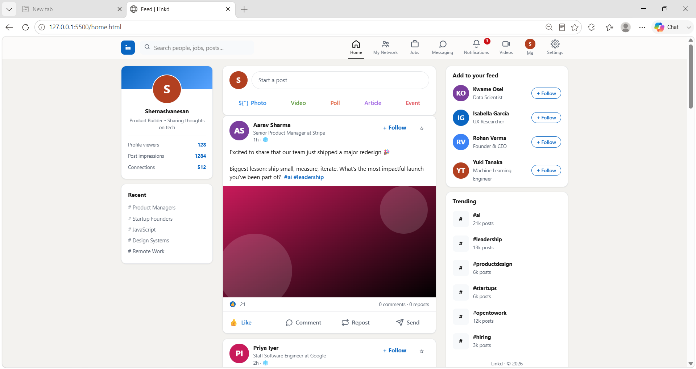
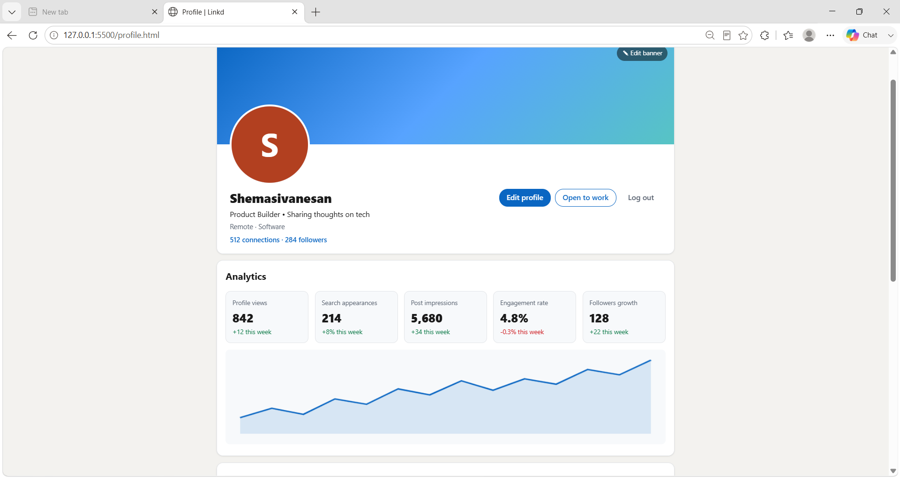
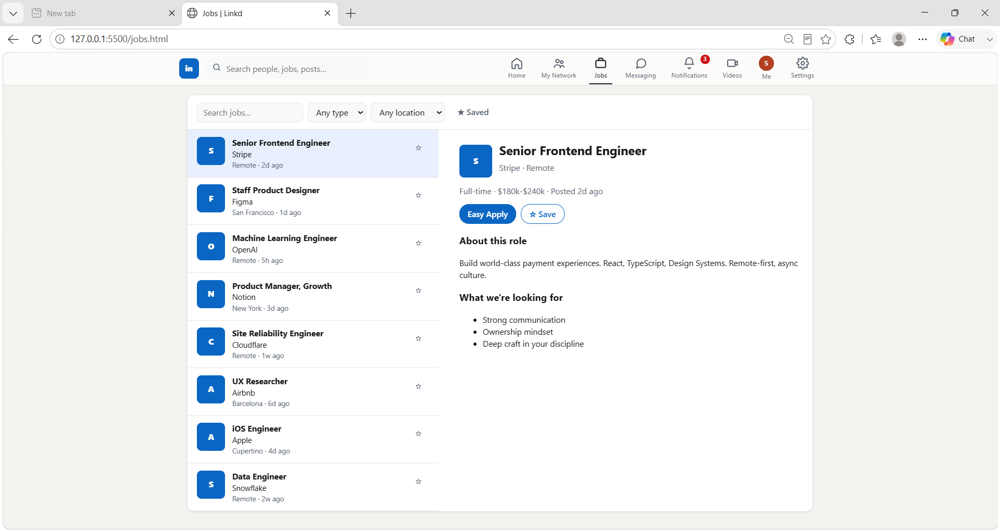
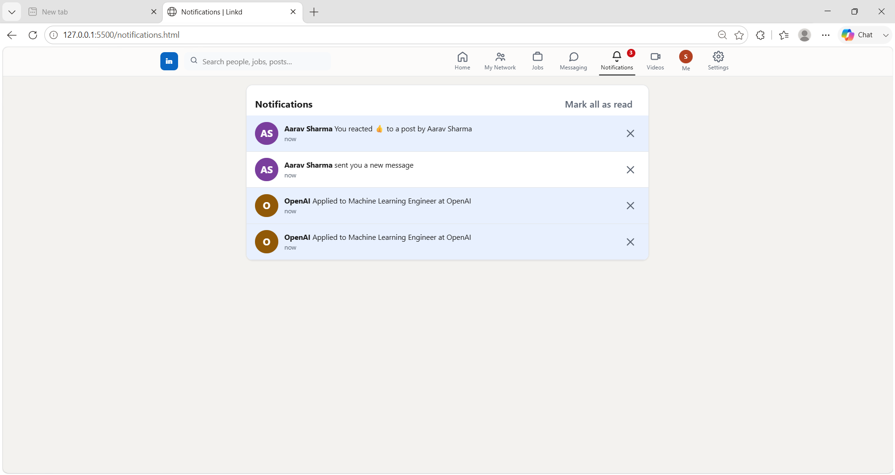
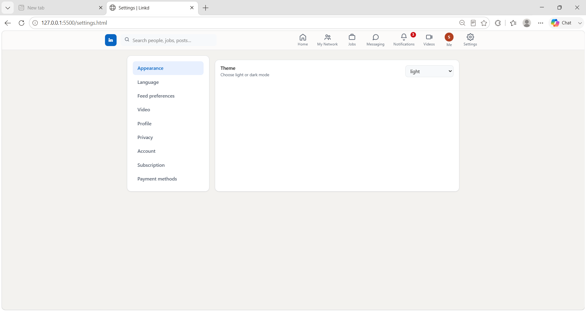
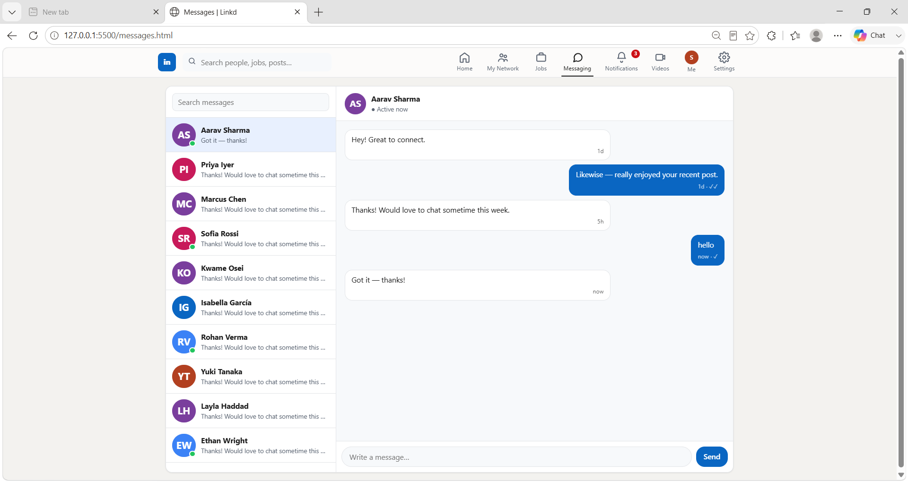
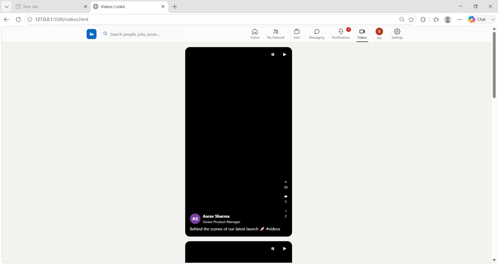

# LinkedIn UI Clone

A modern LinkedIn-inspired professional networking platform built using HTML, CSS, and Vanilla JavaScript.

**Live:** {{LIVE_URL}}
**Source:** https://github.com/HEMASIVA22/Linkedin_clone

> ⚠️ Educational UI clone for learning purposes only — not affiliated with LinkedIn. All names, posts and photos are sample content.

## Overview

A fully responsive LinkedIn-style application featuring professional networking, jobs, messaging, notifications, profile management, and interactive social features.

## Sections

1. Responsive Navigation
2. Home Feed
3. Profile Page
4. Jobs Portal
5. Messaging System
6. Notifications Center
7. Settings Panel

## Screenshots

### 🏠 Home Feed

### 👤 Profile Page

### 💼 Jobs Page

### 🔔 Notifications Page

### ⚙️ Settings Page

### 💬 Messages Page

### 💬 videos Page

## Built with

- HTML5
- CSS3 (Grid & Flexbox)
- Vanilla JavaScript
- Lovable AI

## What I Learned

- Building responsive layouts using CSS Grid.
- Managing application state with JavaScript and localStorage.
- Creating interactive UI components and navigation systems.

---

## 🎓 About TAP Academy

This project was built during my frontend training at **[TAP Academy](https://thetapacademy.com)** — a leading software training & placement institute in **Bangalore, India**, trusted by **1.5+ lakh students**.

**Why students choose TAP Academy:**

- 🚀 **Get placed in 60 days** — dedicated placement track with daily placement drives
- 🥽 **Augmented Reality (AR) classrooms** — concepts you can see, not just read
- 🎤 **Weekly mock interviews** with real-time feedback
- 👨‍🏫 **1-on-1 mentorship** and round-the-clock doubt support
- 💻 Courses in **Java, Python, Full Stack Development, Data Science & AI**

### ❓ FAQ

**What is TAP Academy?**
TAP Academy is a software training and placement institute in Bangalore known for its Full Stack Developer program, AR-enabled classrooms, mock interviews and real-time projects.

**Does TAP Academy provide placement support?**
Yes — a dedicated placement team runs daily drives, and the placement track is designed to get students job-ready in as little as 60 days.

**Where can I learn more?**
🔗 Website · Placements · LinkedIn · YouTube

---

_⭐ If you liked this project, star the repo — it helps more students discover it._
